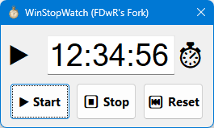

# Stopwatch
Very barebones Win32 application for when I need a stopwatch.

### Features

* Graphical interface
* Counts up in seconds
* Convenient 10kb stand-alone executable with small memory footprint
* Fast to start up and shut down; no web browser, no log-in, does not rely on complicated application frameworks

### Screenshot

**How to use**: There are three buttons: "Start", "Stop", "Reset".

**Start:** Start the timer, or pauses it if already running.

**Stop:** Stop (or rather pause) the timer. Then you can either resume timing with the Start button or clear it with the Reset button.

**Reset:** Reset the time back to 0. The timer continues if it was already running.

If timing is happening, a play symbol appears beside the timer.

## Changes

The following changes were made from https://github.com/clandrew/stopwatch:

- Timer label has bigger numbers for visibility.
- Buttons are larger hit targets.
- Hours displayed (limited to 99 hours).
- Clicking Start again pauses it.
- Clicking Reset only resets the time if already running (does not also stop it).
- Enter/Escape keys start/stop/reset it.
- Tab order fixed.
- Fractional time amounts are preserved when you pause/resume.
- Center dialog in screen rather than top left.

## Build
The project is in C++, built with Visual Studio 2022. Both x86 and x64 builds work.

## System requirements
This application has been tested on Windows 10 on an x86-64 based computer. It likely works back to Windows 7 and any other versions of Windows that have x86 application compatibility.

Windows Defender Smartscreen may complain about this application because it is not commonly downloaded. Smartscreen works in part using [telemetry](https://learn.microsoft.com/en-us/windows/security/threat-protection/microsoft-defender-smartscreen/microsoft-defender-smartscreen-overview) and random executables that aren't blessed by the telemetry can be flagged. You can still run applications that are flagged by Smartscreen if you trust and understand them. Or you can get the source code, build them and run them.
