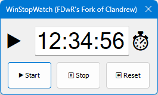

# Stopwatch
Very barebones Win32 application for when I need a stopwatch.

Features:
* Graphical interface
* Counts up in seconds
* Convenient 10kb stand-alone executible with small memory footprint
* Fast to start up and shut down; no web browser, no log-in, does not rely on complicated application frameworks

Looks like this:

**How to use**: there are three buttons, "Start", "Stop", and "Reset".

**Start:** Starts the timer.

**Stop:** Stops, or pauses, the timer. From there, you can either resume timing with the Start button or clear it with the Reset button.

**Reset:** Stops the timer and clears the time back to 0.

If timing is happening, a dot appears beside the timer.

The timing goes up to 1 hour, then resets automatically.

## Build
The project is in C++, built with Visual Studio 2019. The x86 build is supported.

## System requirements
This application has been tested on Windows 10 on an x86-64 based computer. It is likely to work on other versions of Windows that have x86 application compatibility.

Windows Defender Smartscreen may complain about this application because it is not commonly downloaded. Smartscreen works in part using [telemetry](https://learn.microsoft.com/en-us/windows/security/threat-protection/microsoft-defender-smartscreen/microsoft-defender-smartscreen-overview) and random executables that aren't blessed by the telemetry can be flagged. You can still run applications that are flagged by Smartscreen if you trust and understand them. Or you can get the source code, build them and run them.
